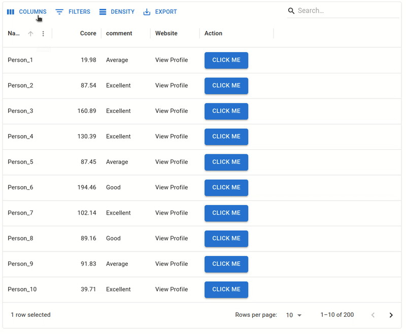

# Table Widget
[](https://badge.fury.io/py/table-widget)
[](http://table-widget.readthedocs.io/)
[](https://github.com/superstar54/table-widget/actions/workflows/ci.yml)

The **Table Widget** is an interactive, customizable data table widget designed for notebooks. It allows you to visualize and interact with tabular data using an intuitive interface built with React and Material-UI. Follow this guide to get started quickly.


**Key Features**:

1. **Interactive Table**: Supports editing, filtering, sorting, and pagination.
2. **Customizable Columns**: Configure column types (e.g., numbers, buttons, links).
3. **Dynamic Styling**: Adjust table styles dynamically.
4. **Event Handling**: React to user interactions like row updates, button clicks, and row selection.
5. **Integration with Pandas**: Easily load data from Pandas DataFrames.




## Installation

```sh
pip install table_widget
```

## Demo
Please try the widget in the following links:
[](https://colab.research.google.com/github/superstar54/table-widget/blob/main/examples/example.ipynb)


## Documentation

Full documentation at: [table-widget.readthedocs.io](https://table-widget.readthedocs.io/en/latest/)


## Development

We recommend using [uv](https://github.com/astral-sh/uv) for development.
It will automatically manage virtual environments and dependencies for you.

```sh
uv run jupyter lab example.ipynb
```

Alternatively, create and manage your own virtual environment:

```sh
python -m venv .venv
source .venv/bin/activate
pip install -e ".[dev]"
jupyter lab example.ipynb
```

The widget front-end code bundles it's JavaScript dependencies. After setting up Python,
make sure to install these dependencies locally:

```sh
npm install
```

While developing, you can run the following in a separate terminal to automatically
rebuild JavaScript as you make changes:

```sh
npm run dev
```

Open `example.ipynb` in JupyterLab, VS Code, or your favorite editor
to start developing. Changes made in `js/` will be reflected
in the notebook.
